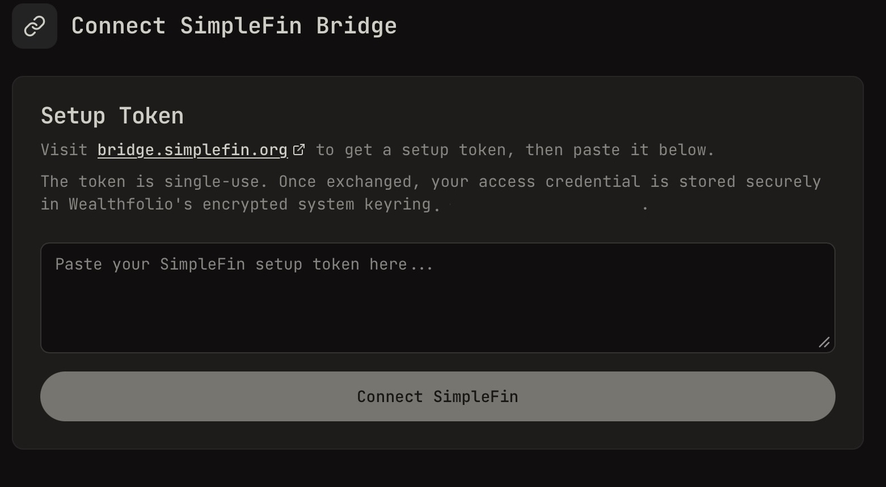
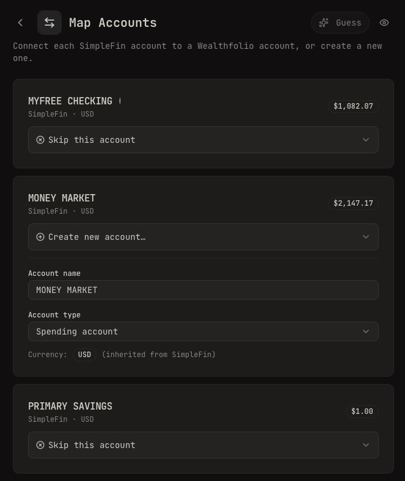
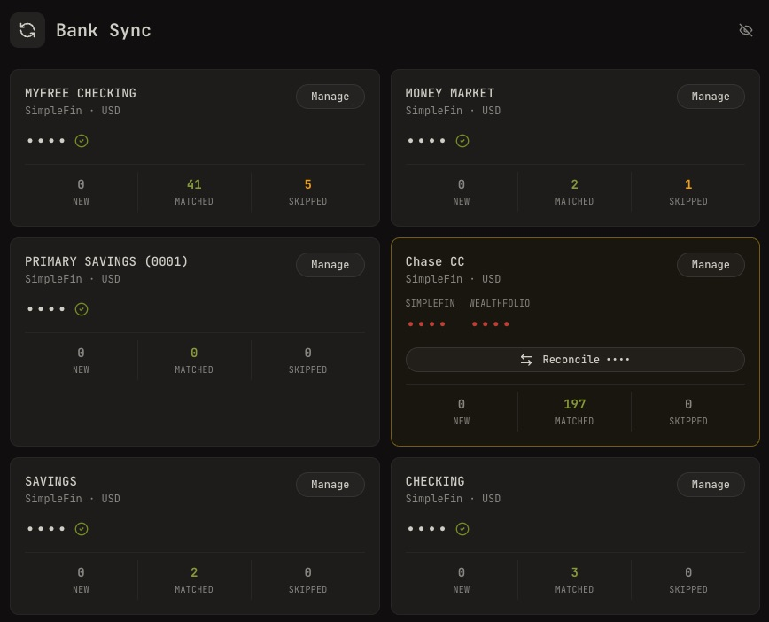

# Bank Sync Addon for Wealthfolio

A [Wealthfolio](https://wealthfolio.app) addon that pulls your transactions from [SimpleFin Bridge](https://bridge.simplefin.org) and imports them into Wealthfolio — with fuzzy duplicate detection so you never double-count a transaction.

> [!WARNING]
> This is an independent project and is not affiliated with, endorsed by, or associated with [SimpleFin](https://simplefin.org) or [Wealthfolio](https://wealthfolio.app) in any way.

## What it does

This addon secure connects to SimpleFin Bridge's API to fetch your accounts and transactions.

1. You paste a one-time Setup Token from SimpleFin Bridge
2. The addon exchanges it for a persistent Access URL (stored securely in Wealthfolio's secret store)
3. On first sync, you match your SimpleFin accounts to your Wealthfolio accounts.
4. On each subsequent sync, it fetches your accounts and transactions from SimpleFin
5. Incoming transactions are fuzzy-matched against your existing Wealthfolio activities by amount, date, and description
6. You review the results and confirm which transactions to import

The addon caches fetched account data to minimize API calls. You can trigger a manual refresh if you make changes in SimpleFin Bridge or you think there's new transactions to sync.

## Screenshots

| Connect SimpleFin Bridge | Map Accounts | Bank Sync Dashboard |
|:---:|:---:|:---:|
|  |  |  |

## Requirements

- [Wealthfolio](https://wealthfolio.app) desktop app
- A subscription to [SimpleFin Bridge](https://bridge.simplefin.org) connected financial institutions

## Permissions

The addon requests the minimum set of permissions needed to function:

| Permission | Purpose |
|---|---|
| `accounts.getAll` | Read existing accounts to match against SimpleFin accounts |
| `accounts.create` | Create new Wealthfolio accounts during account mapping setup |
| `activities.getAll` | Load existing transactions for duplicate detection |
| `activities.saveMany` / `activities.import` | Import confirmed new transactions from SimpleFin |
| `activities.checkImport` | Validate transactions before import |
| `portfolio.getHoldings` | Read account balances to help identify accounts during setup |
| `secrets.get/set/delete` | Persist the SimpleFin Access URL in Wealthfolio's encrypted keyring |
| `sidebar.addItem` | Navigation entry point |

## A note on how this was built

Every line of code in this project was written with AI assistance and reviewed by hand before being committed. No generated code ships without a human reading it first.

## Disclaimer & Warranty

> [!WARNING]
> This software is provided **"as is"**, without warranty of any kind, express or implied. Use it at your own risk.
>
> The author makes no guarantees about the accuracy of imported transactions, account balances, or any financial data processed by this addon. You are solely responsible for verifying that your financial data is correct after any sync operation. Always reconcile imported transactions against your official bank statements.
>
> Because this addon has access to sensitive financial data and your SimpleFin credentials, **you should read and understand the source code before installing or using it**. Do not install software that touches your finances without knowing what it does. But you probably will anyways.

## License

MIT
